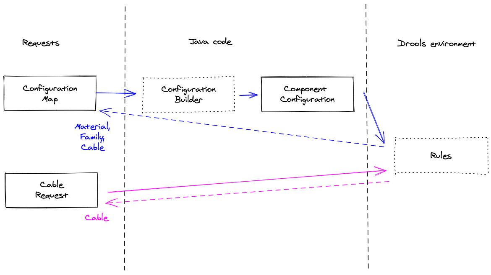

# Overview

In this guide, we will explain how we used Drools. For a more detailed explanation on the Business
Central, check the [Business Central guide](./BUSINESS_CENTRAL.md).

## Drools

[Drools](https://www.drools.org/) is a Business Rules Management System (BRMS) solution. It allows to write
rules with a DSL named `DRL`.

A DRL rule is so shaped:

```DRL
// define a rule named "indicator rule 1" which inherits from "indicator super rule"
rule "indicator rule 1" extends "indicator super rule"
    when // this is called `left part` of the rule
        // when an object of type IndicatorConfiguration has property "indicatorType" which is equal to "DMI"
        IndicatorConfiguration( indicatorType == "DMI" )
    then // this is called `right part` of the rule
        // create a new object of type Material with property "materialCode" set to "123456"
        Material result = new Material();
        result.setMaterialCode("123456");
        // insert that new material into the knowledge
        insert(result);
end
```

All materials are saved in a data space called `knowledge`, that can be queried at the end of the operation in order
to retrieve all newly inserted objects (materials).

Note that inheriting another rule means that the incoming object must match the conditions of both the current rule
and the super rule.

```
rule "super rule"
    when
        IndicatorConfiguration( componentType == "COP" )
    then 
        // we leave the right part of the super-rule empty
        // as we do not want to perform any common action
end

// to match the following rule the indicator configuration must have a COP component type and a DMI indicator type
// DMI indicators whose componentType is LOP will not match this rule
rule "inheriting rule" extends "super rule"
    when
        IndicatorConfiguration( indicatorType == "DMI" )
    then 
        ...
end
```

## Rules

The Drools Knowledge can be queried in two ways:
-  Providing a configuration map
-  Providing a cable request



Component Configurations contain all the features of the component requested by the user. Rules matching those
objects can return three kinds of materials:

-  `Material` objects, that represent a unique pair of `family code` and `material code`. Inserting a Material
into the knowledge means `Get the material identified by those two codes`. In general,
`additional` materials are added this way.
-  `Family` objects, that represent a `family code` and a `price position` type (which is always set to
`basic` because additional materials are always added as Materials and not as Families). Inserting a 
family into the knowledge means `Get all the material of that family with that price position`.
In general, `basic` materials are added this way.
-  `Cable` objects, similar to Materials, with a `family code` and a `material code`, with an additional `length`
 field.

The configuration builders will convert the generic component configuration to a specific one,
depending on the content of the configuration map. The specific component configuration will then be
forwarded to the Drools environment. For more about configuration builders, see the
[Java code](#java-code) section.

On the other hand, a Cable Request is sent when we want to get the "sibling version" of a given cable. 
Two sibling cables are two cables that match the same component configuration but differ for being 
the `standard` and `on commission` versions. So, a Cable request is sent when you have a standard 
version of a cable and you want to get the on commission one, or vice-versa. In this case, the cable
request is directly dispatched to the Drools environment.

## Code organization

The project contains both Java and Drools specific (DRL and GDST) code. 

The Java code contains beans representing the inputs and outputs to the knowledge. More specifically, it includes `Configuration` 
beans that map the input component configuration and several beans for the materials and cables output from running the rules.

Drools code contains the definition of all the rules that match the incoming configuration to a list of materials
and cables. 

### Java code

Java code is split into 4 main packages:

-  `components` contains all DTOs for Drools-known component configurations, such as 'IndicatorConfiguration'.
-  `materials` contains all parts of the materials hierarchy that we can create in the right part of the rules: we can 
create materials, cables or families. A family is a group of materials identified by a common code.
-  `builders` contains all the business logic to convert a generic key-value `Map` into a typed component 
configuration. Builders are divided by common builders, builders for COP components, for LOP components, etc.
Builders must be discoverable from a `CDI` application, so we usually annotate them with `@ApplicationScoped`.
-  `types` contains a set of utility interfaces (with some default method implementations) that are implemented by the 
builders. We have an interface for LOP builders, one for COP ones, etc.

### Drools code

Drools code is placed in the `resources` directory and it contains a directory for each component: we have a directory 
for indicators, one for fixtures, etc.

There are four kinds of knowledge files:

1. `DRL` files;
2. `.gdst` guided decision table files;
3. `.template` guided rules template files;
4. `.enumeration` files.

While DRL and enumeration files are easily readable, `.template` and `.gdst` files are customized `xml` files
that must be opened with the [Business Central](./docs/BUSINESS_CENTRAL.md).

Please note that `.template` and `.gdst` files will be compiled to `.drl` files, they are just a different way
to define rules. `.enumeration` files are utility files for simplifying the usage of the Business Central.